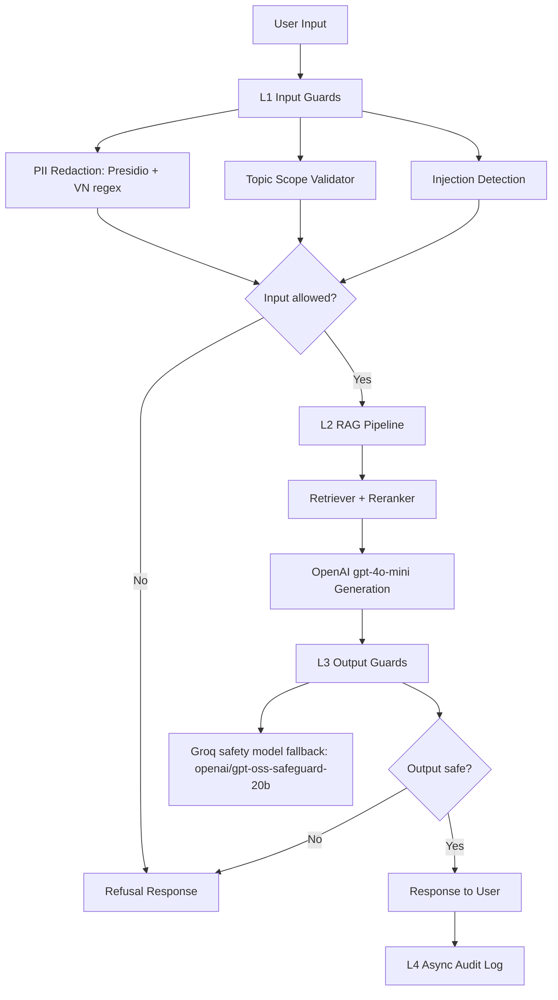

# Lab 24 Production Blueprint

Blueprint nay mo ta cach van hanh he thong RAG co evaluation va guardrails. Cac so lieu thuc te can duoc cap nhat sau khi chay cac script trong Phase A, B va C.

## 1. SLO Definition

| Metric | Target | Alert Threshold | Severity |
|---|---:|---:|---|
| Faithfulness | >= 0.85 | < 0.80 for 30 min | P2 |
| Answer Relevancy | >= 0.80 | < 0.75 for 30 min | P2 |
| Context Precision | >= 0.70 | < 0.65 for 1 hour | P3 |
| Context Recall | >= 0.75 | < 0.70 for 1 hour | P3 |
| P95 Latency with guardrails | < 2.5s | > 3.0s for 5 min | P1 |
| Input guardrail detection rate | >= 90% | < 85% per eval run | P2 |
| Output guardrail false positive rate | <= 20% | > 20% per eval run | P2 |

## 2. Architecture Diagram

Latency budget:

| Layer | Target P95 | Notes |
|---|---:|---|
| L1 Input Guards | < 50ms | Regex and topic checks should be local/fast. |
| L2 RAG | Project-dependent | Dominated by retrieval, rerank, and OpenAI generation. |
| L3 Output Guard | < 100ms target | Current Groq safety fallback measured ~683.851ms P95, so this is the main bottleneck. |
| L4 Audit Log | Async | Not counted in user-facing latency budget. |

Measured baseline: local heuristic output guard total P95 was ~12.8ms, while Groq safety fallback total P95 was ~693.010ms. The external safety API therefore adds roughly +680ms P95 overhead in this lab run.

## 3. Alert Playbook

### Incident: Faithfulness drops below 0.80

**Severity:** P2  
**Detection:** RAGAS eval gate or scheduled evaluation.

**Likely causes:**
1. Retriever returns irrelevant chunks.
2. Prompt changed and allows unsupported claims.
3. Corpus updated without re-indexing.

**Investigation steps:**
1. Compare faithfulness with context precision and context recall.
2. Inspect bottom 10 questions in `phase-a/failure_analysis.md`.
3. Check recent prompt, corpus, and index changes.

**Resolution:**
- If retrieval is weak, increase `top_k`, add reranking, or rebuild index.
- If generation is weak, restore grounded prompt and lower temperature.
- If corpus drifted, clean and re-index the corpus.

**SLO impact:** Track time to detect and time to recover.

### Incident: Topic guard blocks legitimate questions

**Severity:** P2  
**Detection:** High false positive rate in `topic_test_results.csv` or user reports.

**Likely causes:**
1. Allowed topics are too narrow.
2. Vietnamese synonyms are missing.
3. Rule-based guard cannot handle paraphrases.

**Investigation steps:**
1. Review false positives from the topic test set.
2. Group blocked examples by missing keyword or intent.
3. Compare with embedding/LLM-based topic validator if available.

**Resolution:**
- Expand allowed topic vocabulary.
- Add domain synonyms.
- Move to embedding or LLM zero-shot validation if rule-based accuracy is not enough.

**SLO impact:** Monitor false positive rate and refusal rate.

### Incident: Guardrail latency exceeds budget

**Severity:** P1  
**Detection:** P95/P99 latency in `phase-c/latency_benchmark.csv`.

**Likely causes:**
1. Output guard API network latency.
2. L1 checks running sequentially.
3. RAG generation dominates total latency.

**Investigation steps:**
1. Compare L1, L2, L3, and total percentiles.
2. Re-run benchmark with output guard in heuristic mode to isolate API overhead.
3. Check API provider status and timeout/retry settings.

**Resolution:**
- Run independent guards in parallel.
- Cache repeated safety decisions for identical responses when appropriate.
- Use a faster model/provider for guardrails or self-host if volume justifies it.

**SLO impact:** P95 latency above 3 seconds is P1 because it affects all users.

## 4. Cost Analysis

Assumption: 100k production queries/month, 1% continuous eval sample, and 10% judge sample.

| Component | Unit Cost | Volume | Monthly Cost |
|---|---:|---:|---:|
| RAG generation with OpenAI gpt-4o-mini | To update from actual token logs | 100k queries | TBD |
| RAGAS continuous eval | To update from actual token logs | 1k queries | TBD |
| LLM judge with OpenAI gpt-4o-mini | To update from actual token logs | 10k judgments | TBD |
| Presidio + regex PII guard | Self-hosted CPU | 100k queries | $0 incremental |
| Topic/injection guard | Local rules in current implementation | 100k queries | $0 incremental |
| Groq output safety fallback | Provider/API dependent | 100k queries | TBD |
| Logging and storage | Depends on retention | 100k events | TBD |

Cost optimization opportunities:

- Sample continuous eval instead of judging every query.
- Use `gpt-4o-mini` for judge runs unless a harder rubric needs a stronger model.
- Use local regex/rule checks for cheap L1 guardrails.
- Compare Groq/API safety cost with self-hosting only after measured traffic is known.
- Log token usage per run so README numbers are based on actual usage, not guesses.
